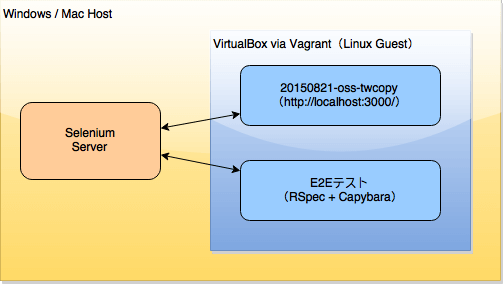

% OSS普及協議会Ruby勉強会3
% [Tokushima.rb](http://tokushimarb.github.io)
% 2015-09-11

# はじめに

このスライドは公開されています。

このスライドのリポジトリは[https://github.com/tokushimarb/20150911-e2e-test-slide](https://github.com/tokushimarb/20150911-e2e-test-slide)にあります。
また、本講座で開発する E2E テストは、[https://github.com/tokushimarb/20150911-e2e-test](https://github.com/tokushimarb/20150911-e2e-test)にあります。

間違いなどを見つけた場合は

<ul>
<li>メールで連絡</li>
<li>Issueで報告</li>
<li>Pull Requestで修正案を提出</li>
</ul>

などしていただけるとありがたいです (※下に行くほど嬉しいです)

# 自己紹介

<ul>
<li>氏名: [中野英雄](https://github.com/sunny4381)</li>
<li>勤務先: [株式会社ウェブチップス](http://www.web-tips.co.jp/)</li>
</ul>

# 目次

<ul>
<li>本講座でのE2Eテスト</li>
<li>環境構築</li>
<li>E2E テストプロジェクトの作成</li>
<li>E2E テスト書いてみる</li>
<li>応用問題</li>
<li>質疑応答</li>
</ul>

# 本講座でのE2Eテスト

## E2Eテストとは？

E2E とは「End-to-End」の略で、E2Eテストとは、システム全体が正しく動作することを確認するテストのこと。

参考:
<ul>
<li>[e2e - TDDの導入とエンドツーエンドテスト自動化の実践まとめ - Qiita](http://qiita.com/bouzuao/items/8e9493d1cb7781b08f2f)</li>
<li>[Run SAP】Run SAP方法論によく出てくる E2E（End-to-End）って何？ - SAP技術ブログ](http://solution.realtech.jp/blog/2011/04/run-sap.html)</li>
<li>[エンドツーエンド原理 - Wikipedia](https://ja.wikipedia.org/wiki/エンドツーエンド原理)</li>
</ul>

# 本講座でのE2Eテスト

## ツール

次のツールを使います。

<ul>
<li>[Selenium](http://www.seleniumhq.org): Web ブラウザーをプログラムから操作できるサービス</li>
<li>[Capybara](https://github.com/jnicklas/capybara): Web アプリケーション テストフレームワーク</li>
</ul>

# 本講座でのE2Eテスト

## テスト対象

テストするアプリケーション:

<ul>
<li>[20150821-oss-twcopy](https://github.com/kaosf/20150821-oss-twcopy): 第2回で開発した Web アプリケーションをテスト</li>
</ul>

# 本講座でのE2Eテスト

## 目標とする環境



# 本講座でのE2Eテスト

## 目標とする環境

<ul>
<li>[Selenium](http://www.seleniumhq.org)は、Windows/Mac Host 側で動作させます。</li>
<li>[20150821-oss-twcopy](https://github.com/kaosf/20150821-oss-twcopy) は、Vagrant 側で動作させます。</li>
<li>E2E テストも、Vagrant 側で動作させます。</li>
<li>E2E テストは、Windows/Mac Host 側で動作している Selenium と通信し、Selenium は 20150821-oss-twcopy にアクセスします。</li>
</ul>

# 環境構築

## 手順

<ol>
<li>Java を Host にインストール（Selenium の動作に必要です）</li>
<li>Selenium と Firefox（か Google Chrome）をインストール</li>
<li>Selenium を起動</li>
</ol>

# 環境構築

## Java を Host にインストール

Selenium の動作に Java が必要です。
Java がインストールされていない人は、

### Windows または Mac

Java を[https://java.com/ja/download/](https://java.com/ja/download/)からダウンロードしてインストールします。

### Linux

`apt-get`（Debian/Ubuntu）か `yum`（CentOS/RHEL）か `dnf`（Fedora） でインストールします。

# 環境構築

## Selenium と Firefox（か Google Chrome）をインストール

### Selenium

[http://www.seleniumhq.org/download/](http://www.seleniumhq.org/download/) から、`selenium-server-standalone-2.47.1.jar` をダウンロード。

### Firefox をインストール

Google Chrome をインストールしていない人は、Firefox を
[https://www.mozilla.org/ja/firefox/new/](https://www.mozilla.org/ja/firefox/new/) からダウンロードしてインストールします。

### Google Chrome

Google Chrome をインストールしている人は、Google Chrome Driver を [http://chromedriver.storage.googleapis.com/index.html?path=2.16/](http://chromedriver.storage.googleapis.com/index.html?path=2.16/) からダウンロードします。

# 環境構築

## Selenium を起動

コマンドプロンプトやシェルから次のコマンドを実行します。

### Firefox を使用する人

```shell
java -jar selenium-server-standalone-2.47.1.jar
```

### Google Chrome を使用する人

```shell
java -Dwebdriver.chrome.driver=chromedriver -jar selenium-server-standalone-2.47.1.jar
```

# 環境構築

## Selenium を起動

起動に成功すると、次のようなメッセージが表示されます。

```
09:37:11.066 INFO - Launching a standalone Selenium Server
09:37:11.124 INFO - Java: Oracle Corporation 25.25-b02
09:37:11.124 INFO - OS: Mac OS X 10.10.5 x86_64
09:37:11.151 INFO - v2.47.1, with Core v2.47.1. Built from revision 411b314
09:37:11.248 INFO - Driver provider org.openqa.selenium.ie.InternetExplorerDriver registration is skipped:
registration capabilities Capabilities [{ensureCleanSession=true, browserName=internet explorer, version=, platform=WINDOWS}] does not match the current platform MAC
09:37:11.249 INFO - Driver provider org.openqa.selenium.edge.EdgeDriver registration is skipped:
registration capabilities Capabilities [{browserName=MicrosoftEdge, version=, platform=WINDOWS}] does not match the current platform MAC
09:37:11.249 INFO - Driver class not found: com.opera.core.systems.OperaDriver
09:37:11.249 INFO - Driver provider com.opera.core.systems.OperaDriver is not registered
09:37:11.385 INFO - RemoteWebDriver instances should connect to: http://127.0.0.1:4444/wd/hub
09:37:11.385 INFO - Selenium Server is up and running
```

終了するには `Ctrl+C` を押します。

# E2E テストの準備

## Vagrant 起動

Vagrant Box を起動していない人は起動しましょう。

```shell
$ vagrant up
Bringing machine 'default' up with 'virtualbox' provider...
==> default: Importing base box 'ruby-vagrant'...
==> default: Matching MAC address for NAT networking...
==> default: Setting the name of the VM: 20150821-oss-twcopy_default_1440809901768_54170
==> default: Clearing any previously set network interfaces...
==> default: Preparing network interfaces based on configuration...
    default: Adapter 1: nat
==> default: Forwarding ports...
    default: 22 => 2222 (adapter 1)
==> default: Running 'pre-boot' VM customizations...
==> default: Booting VM...
==> default: Waiting for machine to boot. This may take a few minutes...
    default: SSH address: 127.0.0.1:2222
    default: SSH username: vagrant
    default: SSH auth method: private key
...
```

# E2E テストの準備

## 20150821-oss-twcopy の実行

Vagrant Box に SSH で接続し、
第2回で開発した[20150821-oss-twcopy](https://github.com/kaosf/20150821-oss-twcopy)を実行します。

```shell
$ cd $第2回で開発したアプリケーションディレクトリ
$ bin/rails s -b 0.0.0.0
=> Booting WEBrick
=> Rails 4.2.3 application starting in development on http://0.0.0.0:3000
=> Run `rails server -h` for more startup options
=> Ctrl-C to shutdown server
[2015-08-29 10:07:57] INFO  WEBrick 1.3.1
[2015-08-29 10:07:57] INFO  ruby 2.2.2 (2015-04-13) [x86_64-linux]
[2015-08-29 10:07:57] INFO  WEBrick::HTTPServer#start: pid=6738 port=3000
```

# E2E テストの準備

## 挫折者向け

第2回の講座を中途で挫折した人？
第2回で開発した[20150821-oss-twcopy](https://github.com/kaosf/20150821-oss-twcopy)を GitHub から取得し、
起動します。

おそらく git がインストールされていないので、次のコマンドで git をインストールします。

```shell
$ sudo yum install git
```

# E2E テストの準備

## 挫折者向け

GitHub から第2回で開発した[20150821-oss-twcopy](https://github.com/kaosf/20150821-oss-twcopy)を取得します。

```shell
$ git clone https://github.com/kaosf/20150821-oss-twcopy.git
```

# E2E テストの準備

## 挫折者向け

`bundle install` を実行します。

```shell
$ cd 20150821-oss-twcopy
$ bundle install
Fetching gem metadata from https://rubygems.org/............
Fetching version metadata from https://rubygems.org/...
Fetching dependency metadata from https://rubygems.org/..
Resolving dependencies...
Using rake 10.4.2
Using i18n 0.7.0
...
```

# E2E テストの準備

## 挫折者向け

データベースを作成後、Web アプリケーションを実行します。

```shell
$ rake db:migrate
$ bin/rails s -b 0.0.0.0
=> Booting WEBrick
=> Rails 4.2.3 application starting in development on http://0.0.0.0:3000
=> Run `rails server -h` for more startup options
=> Ctrl-C to shutdown server
[2015-08-29 10:07:57] INFO  WEBrick 1.3.1
[2015-08-29 10:07:57] INFO  ruby 2.2.2 (2015-04-13) [x86_64-linux]
[2015-08-29 10:07:57] INFO  WEBrick::HTTPServer#start: pid=6738 port=3000
```

# E2E テストの準備

## 20150821-oss-twcopy へ Web ブラウザでアクセス

起動した Web アプリケーションへ Host 側からアクセスしてみましょう。

```
http://localhost:3000/
```

正常に Web アプリケーションが表示されれば、E2Eテストの準備が完了です。

# E2E テストプロジェクトの作成

## 雛形作成

もう一枚コンソールを開いて Vagrant Box に SSH で接続してみます。
そして、次コマンドを実行し、テストプロジェクトディレクトリを作成してください。

```shell
$ mkdir e2e-test
$ cd e2e-test
$ bundle init
Writing new Gemfile to /home/vagrant/e2e-test/Gemfile
```

# E2E テストプロジェクトの作成

## Gemfile 作成

`bundle init` を実行すると、雛形となる `Gemfile` が作成されます。
`Gemfile` に必要な gem を追加します。

```shell
$ vi Gemfile
```

```ruby
# A sample Gemfile
source "https://rubygems.org"

# gem "rails"
gem 'rspec'
gem 'capybara'
gem 'selenium-webdriver'
```

# E2E テストプロジェクトの作成

## bundle install

ファイルを保存して `bundle install` を実行します。

```
$ bundle install
Fetching gem metadata from https://rubygems.org/.........
Fetching version metadata from https://rubygems.org/..
Resolving dependencies...
Using mime-types 2.6.1
Using mini_portile 0.6.2
...
Installing websocket 1.2.2
Installing selenium-webdriver 2.47.1
Using bundler 1.10.5
Bundle complete! 3 Gemfile dependencies, 20 gems now installed.
Use `bundle show [gemname]` to see where a bundled gem is installed.
```

# E2E テストプロジェクトの作成

## RSpec 初期化

次のコマンドを実行し、rspec を実行できるようにします。

```
$ rspec --init
```

# E2E テストプロジェクトの作成

## RSpec の初期設定

`spec/spec_helper.rb` を編集し、Capybara と Selenium を組み込みます。
`spec/spec_helper.rb` をテキストエディタで開き、次の行を先頭に追加してください。

```ruby
require 'capybara'
require 'selenium-webdriver'

selenium_config = {}
selenium_config[:browser] = :remote
selenium_config[:url] = "http://10.0.2.2:4444/wd/hub"

Capybara.register_driver :remote_firefox do |app|
  Capybara::Selenium::Driver.new(app, selenium_config)
end

Capybara.register_driver :remote_chrome do |app|
  selenium_config[:desired_capabilities] = :chrome
  Capybara::Selenium::Driver.new(app, selenium_config)
end

Capybara.app_host = "http://localhost:3000"
Capybara.default_max_wait_time = 5
# Firefox を使用する人は remote_filefox を、
# Google Chrome を使用する人は remote_chrome を有効にします
Capybara.default_driver = :remote_firefox
# Capybara.default_driver = :remote_chrome
```

# E2E テストプロジェクトの作成

## RSpec の初期設定

`spec/spec_helper.rb` の末尾あたりに次の行を追加します。

```ruby
  # Seed global randomization in this process using the `--seed` CLI option.
  # Setting this allows you to use `--seed` to deterministically reproduce
  # test failures related to randomization by passing the same `--seed` value
  # as the one that triggered the failure.
  Kernel.srand config.seed
=end

  # 次の行を追加
  config.include Capybara::DSL
end
```

# E2E テストプロジェクトの作成

## しおり

ここまでの内容は、GitHub にあります。

```
$ git clone https://github.com/tokushimarb/20150911-e2e-test
$ cd 20150911-e2e-test
```

# E2E テストを書いてみる

## 動作確認用テスト

まずは、プログラムでサーバーにアクセスしてみましょう。
テキストエディタでテストファイル（ここでは `first_e2e_spec.rb`）を作成します。

```shell
$ vi spec/first_e2e_spec.rb
```

テストファイルを次のように編集します。

```ruby
require 'spec_helper.rb'

RSpec.describe "first e2e test", type: :feature do
  it "sign in" do
    visit "/"
  end
end
```

# E2E テストを書いてみる

## テストの実行

`rspec` コマンドを実行すると、テストが開始します。

```
$ rspec
.

Finished in 5.11 seconds (files took 0.29045 seconds to load)
1 example, 0 failures

```

環境や設定などが正しければ、
自動でブラウザが起動して、Web アプリケーションが表示され、自動でブラウザが終了します。

# E2E テストを書いてみる

## しおり

ここまでの内容は、GitHub にあります。

ダウンロードしていない人は、次のコマンドでダウンロードできます。

```shell
$ git clone https://github.com/tokushimarb/20150911-e2e-test
$ cd 20150911-e2e-test
```

ここまでの内容はブランチ "1st-test" にあるので、
次のコマンドで branch を切り替えます。

```shell
$ git checkout 1st-test
```

# E2E テストを書いてみる

## E2E テストを拡充

ユーザーを作ってみましょう。
さっきの続きに次のように書きます。

```ruby
RSpec.describe "first e2e test", type: :feature do
  it "sign in" do
    visit "/"

    # ここから下を追加する
    click_link "Sign up"

    fill_in "user_email", with: "test@example.jp"
    fill_in "user_password", with: "password"
    fill_in "user_password_confirmation", with: "password"
    fill_in "user_name", with: "test"
    click_button "Sign up"
  end
end
```

# E2E テストを書いてみる

## テストの再実行

`rspec` コマンドを実行してください。

```shell
$ rspec
.

Finished in 6.04 seconds (files took 0.28139 seconds to load)
1 example, 0 failures
```

今度も、自動でブラウザが起動して、Web アプリケーションが表示され、自動でブラウザが終了しました。
※あまりにも早くて分からなかったですか？

# E2E テストを書いてみる

## コード解説

1. ブラウザが自動で起動し、"/" にアクセスします。

    ```ruby
    visit "/"
    ```

2. 画面上部の "Sign up" リンクをクリックし、ユーザー登録ページに遷移します。

    ```ruby
    click_link "Sign up"
    ```

3. ユーザー登録ページには、4 つの入力欄があります。
  4 つの入力欄の上から順に、`with` で指定した文字列を入力します。

    ```ruby
    fill_in "user_email", with: "test@example.jp"
    fill_in "user_password", with: "password"
    fill_in "user_password_confirmation", with: "password"
    fill_in "user_name", with: "test"
    ```

4. 画面下部の "Sign up" ボタンをクリックし、登録処理が実行します。

    ```ruby
    click_button "Sign up"
    ```

# E2E テストを書いてみる

## しおり

ここまでの内容は、GitHub にあります。

ダウンロードしていない人は、次のコマンドでダウンロードできます。

```shell
$ git clone https://github.com/tokushimarb/20150911-e2e-test
$ cd 20150911-e2e-test
```

ここまでの内容はブランチ "2nd-test" にあるので、
次のコマンドで branch を切り替えます。

```shell
$ git checkout 2nd-test
```

# E2E テストを書いてみる

## 検証処理の追加

ユーザーを登録しただけで、登録に成功したかどうか検証していません。
ユーザー登録に成功したことを検証してみます。

検証処理を実装する前に、ユーザーの登録に成功すると、どんな画面が表示されるかみてみます。

# E2E テストを書いてみる

## 検証処理の追加

ユーザー登録に成功すると、画面上部のメッセージボックスに、登録成功メッセージ "Welcome! You have signed up successfully." が表示されます。
このメッセージは、次のような HTML で表示されています。

```html
<div class="alert fade in alert-success ">
  <button class="close" data-dismiss="alert">×</button>
  Welcome! You have signed up successfully.
</div>
```

# E2E テストを書いてみる

## 検証処理の追加

画面左のサイドバーには、登録したユーザーの名前が表示されています。
この部分の HTML は次のようになっています。

```html
<div class="well sidebar-nav">
  <h3>Sidebar</h3>
  <dl>
    <dt>Your name</dt>
    <dd>test</dd>
    <dt>Your icon</dt>
    <dd></dd>
  </dl>
  <ul class="nav nav-list">
    <li class="nav-header">Sidebar</li>
    <li><a href="/path1">Link1</a></li>
    <li><a href="/path2">Link2</a></li>
    <li><a href="/path3">Link3</a></li>
  </ul>
</div>
```

# E2E テストを書いてみる

## 検証処理の追加

メッセージボックスに登録成功メッセージが、
サイドバーに登録したユーザー名が表示されていることを検証してみます。
次のコードを追加してください。

```ruby
RSpec.describe "first e2e test", type: :feature do
  it "sign in" do
    visit "/"

    click_link "Sign up"

    fill_in "user_email", with: "test@example.jp"
    fill_in "user_password", with: "password"
    fill_in "user_password_confirmation", with: "password"
    fill_in "user_name", with: "test"
    click_button "Sign up"

    # ここから下を追加する

    # メッセージボックスに、登録成功メッセージが表示されていることを検証する
    within "div.alert-success" do
      expect(page).to have_content("Welcome! You have signed up successfully.")
    end
    # サイドバーに、ユーザー名 "test" が表示されていることを検証する
    within "div.sidebar-nav" do
      expect(page).to have_content("test")
    end
  end
end
```

# E2E テストを書いてみる

## データベースの初期化

`test` というユーザーが登録されているので、テストを再実行しても登録に失敗しますので、データベースを削除します。

Web アプリケーションを実行しているターミナルを表示し、キーボードから `Ctrl+C` を入力し Web アプリケーションを停止します。

```shell
^C[2015-08-29 21:47:16] INFO  going to shutdown ...
[2015-08-29 21:47:16] INFO  WEBrick::HTTPServer#start done.
Exiting
```

# E2E テストを書いてみる

## データベースの初期化

`rake db:drop` でデータベースを削除し、`rake db:migrate` でデータベースを作成後、Web アプリケーションを実行します。

```shell
$ rake db:drop
$ rake db:migrate
$ bin/rails s -b 0.0.0.0
=> Booting WEBrick
=> Rails 4.2.3 application starting in development on http://0.0.0.0:3000
=> Run `rails server -h` for more startup options
=> Ctrl-C to shutdown server
[2015-08-29 21:48:34] INFO  WEBrick 1.3.1
[2015-08-29 21:48:34] INFO  ruby 2.2.2 (2015-04-13) [x86_64-linux]
[2015-08-29 21:48:34] INFO  WEBrick::HTTPServer#start: pid=4693 port=3000
```

# E2E テストを書いてみる

## テストの再実行

`rspec` コマンドを実行してください。

```shell
$ rspec
.

Finished in 6.63 seconds (files took 0.26859 seconds to load)
1 example, 0 failures

```

`0 failures` と表示されているので、テストに成功したことがわかります。

# E2E テストを書いてみる

## コード解説

1. class `alert-success` を持つ `<div>` タグ内に、"Welcome! You have signed up successfully." があることを検証します。

    ```ruby
    within "div.alert-success" do
      expect(page).to have_content("Welcome! You have signed up successfully.")
    end
    ```

    メッセージボックスに "Welcome! You have signed up successfully." が表示されていることを検証しています。

2. class `sidebar-nav` を持つ `<div>` タグ内に、"test" があることを検証します。

    ```ruby
    within "div.sidebar-nav" do
      expect(page).to have_content("test")
    end
    ```

    サイドバーに登録したユーザー名が表示されていることを検証しています。

# E2E テストを書いてみる

## しおり

ここまでの内容は、GitHub にあります。

ダウンロードしていない人は、次のコマンドでダウンロードできます。

```shell
$ git clone https://github.com/tokushimarb/20150911-e2e-test
$ cd 20150911-e2e-test
```

ここまでの内容はブランチ "3rd-test" にあるので、
次のコマンドで branch を切り替えます。

```shell
$ git checkout 3rd-test
```

# 応用問題

## E2E テストの流れ

1. ブラウザでアクセスし、どんな画面が表示されるかを確認。
2. その際、どんなタグのどんなクラスを持つかを確認。
3. ブラウザ操作を、プログラムとして作成し、表示されているタグを検証。

# 応用問題

## 課題

次のような E2E テストで作成してみてください。

* ユーザー登録の際、パスワードが 8 桁より短いとエラーが表示されます。
  エラーになるかどうか検証してください。
* ツイートを投稿してみて、本当に投稿されたかどうか検証してみてください。
* もう一人別のユーザーを登録し、フォローして、本当にフォローされたかどうか検証してみてください。
* など。

# 質疑応答


# ありがとうございました

* Tokuhima.rb は、毎月、徳島マルシェの開催される最終日曜日の 10:00 〜 16:00 に、ねすとラボ でゆる〜く開催しています。

* オープンソースカンファレンス徳島（OSC徳島）が、11月14日（土曜日）にとくぎんトモニプラザで開催されます。
